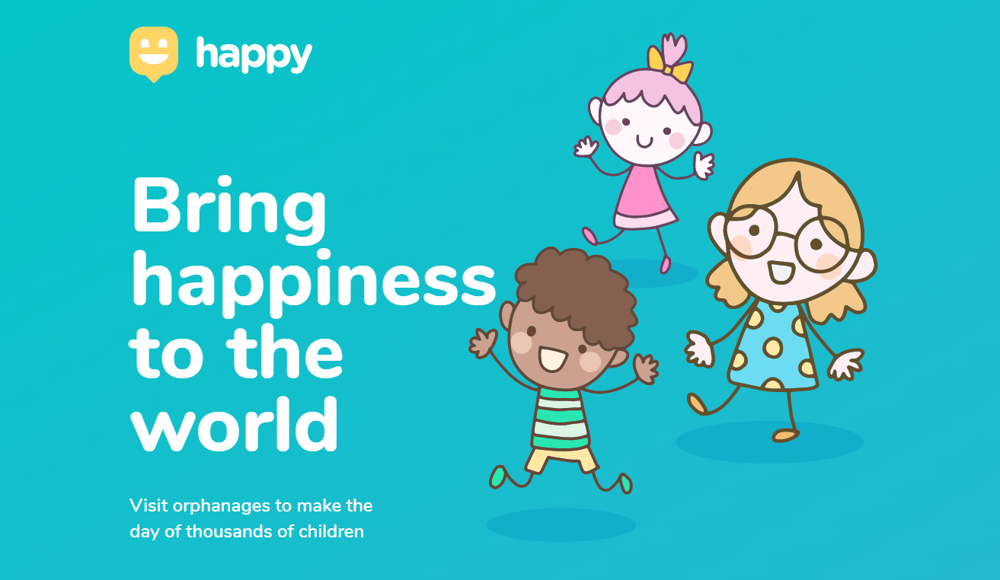

<h1 align="center">
  Happy
</h1>

Bring happiness to the world. Make a better world.

  

  

  
  

## :computer: The Project

This initiative was started by [Rocketseat](https://rocketseat.com.br/) and inspired by Children's Day! **_Happy_** connects orphanages and children's institutions to the world. Each human being has the power to change the world by bringing happiness to the life of our children. 

## :rocket: Technologies

The project was developed using the following technologies:

- [TypeScript](https://www.typescriptlang.org/)
- [Node.js](https://nodejs.org/en/)
- [ReactJS](https://reactjs.org)

## :electric_plug: Installation and Execution
Clone this repository:

	$ git clone https://github.com/andre-silva-14/happy.git

#### Running the API Server:
	
	$ cd happy/server
	$ yarn install
	$ yarn dev

#### Running the Web Server:

This project uses [Mapbox](https://www.mapbox.com/) services, to get an API Token register [here](https://account.mapbox.com/auth/signup/).

Create a `.env` file in the root directory of `web` project containing the following information:

	# Your Public API Token from Mapbox
	REACT_APP_MAPBOX_TOKEN=
	# The URL where the API Server is running. If you didn't make changes, keep the one bellow.
	REACT_APP_API_URL=http://localhost:3333/

Once your Environment Variables are set, you are ready to run the app:

	$ cd happy/web
	$ yarn install
	$ yarn start

## :memo: License

This project is under the MIT license. See [LICENSE](LICENSE.md) for more details.